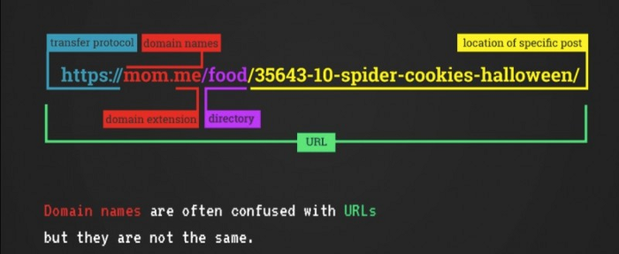
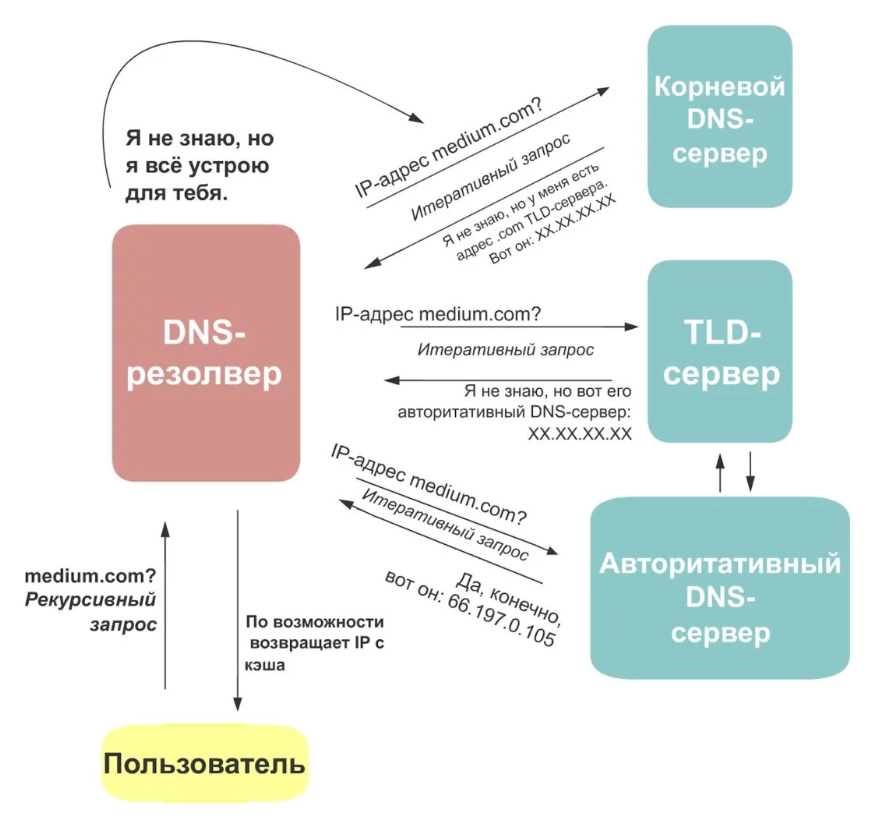
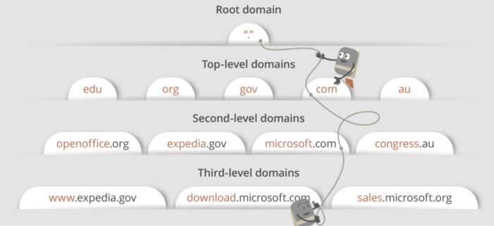

# YOU SHOULD DEFINITELY UNDERSTAND WHAT HAPPENS WHEN YOU TYPE SOMETHING IN URL address and press ENTER

## Полезные ссылки 

[What Happens When You Type a Url in Your Browser and Press Enter](https://dev.to/nicolasmesa/what-happens-when-you-type-a-url-in-your-browser-and-press-enter-1iif)

[What happens when you type a URL in your browser and hit ‘Enter’](https://medium.com/@bchen720/what-happens-when-you-type-holbertonschool-com-in-your-browser-and-hit-enter-42cbd7a7a720)

[What happens when you type in a URL and press enter?](https://medium.com/@laurenhp95/what-happens-when-you-type-in-a-url-and-press-enter-45c64a4bf82f)

[What happens when you type an URL in the browser and press enter?](https://medium.com/@graceodonnell/what-happens-when-you-type-an-url-in-the-browser-and-press-enter-be22335fc3a0)

[What happens when you type a URL in your browser and press enter?](https://medium.com/@birnbera/what-happens-when-you-type-a-url-in-your-browser-and-press-enter-f5f4957ba108)

[What Happens When You Type in a URL](https://wsvincent.com/what-happens-when-url/)

[What happens when you type 'google.com' into a browser and press Enter?](https://dev.to/antonfrattaroli/what-happens-when-you-type-googlecom-into-a-browser-and-press-enter-39g8)

[Коды состояний HTTP](http://www.restapitutorial.ru/httpstatuscodes.html)

[Простым языком об HTTP](https://habr.com/ru/post/215117/)

[Что такое User Agent](https://8500.ru/user-agent/)

[Протоколы TCP и UDP](http://cloud.mppl.mk.ua/ccna.mppl.mk.ua/CCNA%201%20RUS/course/module7/7.2.1.3/7.2.1.3.html)

[3-х этапное рукопожатие TCP](https://ddos-guard.net/ru/terminology/protocols/3-h-etapnoe-rukopozhatie-tcp)

[Что такое DNS? Введение в систему доменных имён](https://tproger.ru/explain/domain-name-system/)

## Запрос DNS

Когда вы  набираете http://google.com (или любой другой URL) в своем браузере и нажимаете **Enter**, ваш браузер не знает, является ли это допустимым доменным именем, и как связаться с сервером, на котором размещено его содержимое, и существует ли адрес вообще. Для этого ему необходимо найти IP-адрес http://google.com, прежде чем он сможет запросить соединение со своего веб-сервера.

**DNS (Domain Name System)** - это метод, с помощью которого браузеры определяют IP-адреса посещаемых пользователями веб-сайтов. DNS охватывает всю совокупность того, как доменные имена, такие как xyz.com, преобразуются в IP-адреса, которые напрямую идентифицируют сервер, на котором размещается контент.

**DNS** - это иерархическая сеть серверов, которые хранят информацию о доменах, которые были зарегистрированы в интернет-центре, таком как **ICANN** (Интернет-корпорация по присвоению имен и номеров). На вершине иерархии находятся 13 корневых серверов имен доменов (на которые указывает один период - ' . '), Которые поддерживают списки всех текущих **TLD (доменов верхнего уровня)** и их серверов имен, таких как .com , .info , .org и многие другие. Каждый **TLD** имеет серверы, которые отслеживают доменные имена, зарегистрированные с этим расширением. Поскольку сайт http://google.com зарегистрирован с расширением .com , домен .com Имя сервера будет иметь ссылку на его местоположение.

Доменные имена обычно приобретаются у регистратора доменных имен, такого как www.gandi.net , который сообщает TLD, что домен зарегистрирован и связан с определенным IP-адресом. Чаще всего IP-адрес, связанный с доменом на сервере имен TLD, фактически является другим сервером имен с более низкой иерархией, например, управляемым самим регистратором или владельцем веб-сайта.

Каждая запись DNS содержит несколько частей информации: 1) тип записи (например, A или NS); 2) домен, связанный с записью; 3) поддомен, прикрепленный к записи; 4) TTL, или время жизни, которое указывает, как долго считать запись действительной, прежде чем вернуться на сервер имен для проверки нового IP-адреса и / или значения TTL.

## Начинаем тернистый путь

Когда вы нажимаете клавишу **Enter**  браузер проверяет свой кэш ранее запрошенных доменов и ищет совпадения. Если он найдет совпадение, он будет использовать этот IP-адрес напрямую и создаст HTTP-запрос **(HyperText Transfer Protocol)** для этого сайта.
В противном случае начинается рекурсивный процесс, при котором браузер проверяет ОС, которая имеет собственный отдельный кеш, чтобы узнать, запрашивало ли другое приложение этот домен в последнее время. Предполагая, что его там нет, ОС затем проверяет шлюз, часто модем или маршрутизатор, чтобы узнать, был ли там сохранен IP-адрес. Маршрутизатор (модем), обычно имеет DNS-сервер по умолчанию, размещенный провайдером, который проверяет свой собственный кеш. Если он не найден, он выдаст DNS-запрос, возможно, на другие DNS-серверы, кэширующие больший регион, и, наконец, запросит корневой сервер имен, если он нигде не был кэширован (или если TTL везде превышен).

***Разберём рисунок выше:***

- 1. Пользователь выполняет запрос к резолверу для поиска IP-адреса. Это рекурсивный запрос.
- 2. Резолвер по возможности просматривает свой кэш на наличие необходимого IP-адреса.
- 3. Если у резолвера есть необходимый IP-адрес, то он возвращает его.
- 4. В противном случае резолвер выполняет итеративный запрос на корневой DNS-сервер. Корневой DNS-сервер ищет нужный TLD для запрашиваемого адреса. К примеру, если хост —  medium.com, то TLD — .com. Корневой DNS-сервер находит адрес .com-домена и возвращает ответ резолверу.
- 5. Теперь резолвер выполняет итеративный запрос на TLD-сервер, чтобы получить необходимый IP-адрес. TLD-сервер возвращает адрес авторитативного сервера для запрашиваемого хоста.
- 6. Авторитативный сервер хранит фактические записи сопоставления имени хоста с IP-адресом, который возвращается резолверу (тот, в свою очередь, возвращает его пользователю).
- 7. Если на авторитативном сервере нужной записи не существует, то возвращается ошибка «DNS_PROBE_FINISHED_NXDOMAIN».
- 8. Для всех серверов, через которые проходит запрос, результат кэшируется, и в случае повторного запроса результат уже будет на сервере.
- 9. В среднем для DNS-поиска потребуется около 4 запросов, но время этого поиска будет составлять всего несколько миллисекунд.

Этот тип поиска называется рекурсивным поиском, поскольку поиск будет продолжаться с DNS-сервера на DNS-сервер до тех пор, пока он не найдет нужный IP-адрес или не выдаст ответ об ошибке, в котором говорится, что он не может его найти ».

> Рекурсия - это когда функция может вызывать себя сама.

Если имя будет разрешено DNS-запросом, браузер получит IP-адрес и будет использовать его для установления соединения с веб-сервером по этому IP-адресу.

> **Time to live (TTL)**– это время жизни пакета. **TTL** показывает максимальный период времени существования набора данных (пакета).

## HTTP-запрос и TCP / IP

> **TCP**, сокращенно от **Transmission Control Protocol** – это стандарт, определяющий как устанавливать и поддерживать связь, через которую две программы могут обмениваться данными.

> Этот протокол был создан в 1978 году **Робертом Каном** и **Винтоном Серфом** – изобретателем протокола IP. TCP является основным компонентом протокола TCP/IP, который определяет, как информация передается через Интернет.

> «**IP-адрес** - это уникальный адрес, идентифицирующий машину (это может быть компьютер, сервер, электронное устройство, маршрутизатор, телефон и т. д.)»

Как только браузер получит IP-адрес хоста, к которому он пытается подключиться, он отправит запрос на подключение по этому адресу, чтобы он мог начать загружать контент, такой как HTML и другие ресурсы. Метод, который он использует для связи с сервером, - это TCP **(Transmission Control Protocol)**, который является протоколом для обмена данными между двумя компьютерами, который делает работу надежной и безошибочной. Это только один из многих протоколов для связи по сетям, но он является основным для HTTP-запросов. Другие протоколы, такие как UDP , не гарантируют надежного соединения и не пытаются повторно отправить потерянные или поврежденные данные, но они действительно используются для потоковой передачи контента и других областей, требующих низкой задержки в сети, где допускаются ошибки.

## Запрос соединения через TCP / IP

Перед отправкой HTTP-запроса на сайт http://google.com (или 216.58.208.46) браузер должен установить соединение. Это делается с помощью так называемого трехстороннего рукопожатия. Сначала браузер отправляет запрос синхронизации (SYN) на порт 80 IP-адреса, к которому он пытается подключиться. Порт 80 является хорошо известным портом, связанным с протоколом HTTP. Если сервер прослушивает порт 80 и принимает запросы, он ответит ответом синхронизации и подтверждения (SYN-ACK). Для того чтобы установить соединение, браузер должен затем отправить подтверждение (ACK) и привязать некоторый собственный порт к порту 80 на хосте.

Все это происходит в операционной системе, и результат, наконец, предоставляется браузеру, причем соединение либо было успешно установлено, и сгенерирован дескриптор файла сокета для чтения и записи, либо некоторый код ошибки, если соединение не удалось.

Существует пять основных категорий ответов: информационные ответы (1xx), успешные ответы (2xx), перенаправления (3xx), ошибки клиента (4xx) и ошибки сервера (5xx).

## Браузер отправляет HTTP-запрос на веб-сервер.

«Браузер отправит **GET** запрос на веб-страницу. Если вы вводите учетные данные или отправляете форму, это может быть запрос **POST**. Этот запрос также будет содержать дополнительную информацию, такую ​​как идентификация браузера (заголовок User-Agent), типы запросов, которые он примет (заголовок Accept )».

> **User Agent** — это строка, которую используют веб-браузеры в качестве своего имени, она содержит не только имя браузера, но и версию операционной системы и другие параметры. По user agent можно определить достаточно много параметров, например, название операционной системы, её версию и разрядность. Также можно определить и само устройство, на котором установлен браузер, это может быть компьютер, планшет, iPhone, iPad или другое мобильное устройство. Еще по user agent можно определить функции, которые поддерживает веб-браузер, например, JavaScript, Java Applet, Cookie, VBScript и Microsoft's ActiveX.

## Сервер обрабатывает запрос и отправляет ответ.

«Сервер содержит веб-сервер (то есть Apache, IIS), который получает запрос от браузера и передает его обработчику запросов для чтения и генерации ответа. Обработчик запросов - это программа (написанная на ASP.NET, PHP, Ruby и т. Д.), Которая считывает запрос, его заголовки и файлы cookie, чтобы проверить, что запрашивается, а также обновить информацию на сервере, если это необходимо. Затем он соберет ответ в определенном формате (JSON, XML, HTML) ».

## Сервер отправляет HTTP-ответ.

Сервер отправляет веб-страницу, которую вы искали, а также некоторую другую информацию, такую ​​как «как кэшировать страницу (Cache-Control), любые файлы cookie для установки, информацию о конфиденциальности и т. д.»

## Браузер отображает содержимое HTML

«Браузер отображает содержимое HTML поэтапно. Во-первых, он будет отображать скелет HTML. Затем он проверит теги HTML и отправит GET-запросы на дополнительные элементы на веб-странице, такие как изображения, таблицы стилей CSS, файлы JavaScript и т. Д. Эти статические файлы кэшируются браузером, поэтому он не должен извлекать их снова. в следующий раз, когда вы посетите страницу. В конце вы увидите, что ваш сайт появился в вашем браузере».